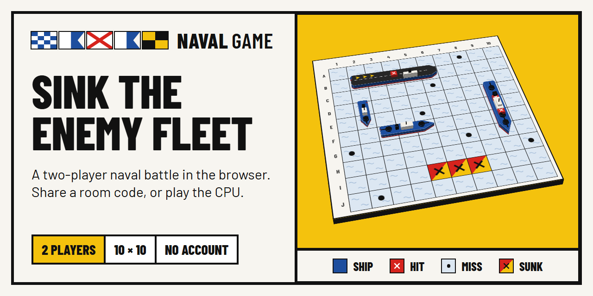
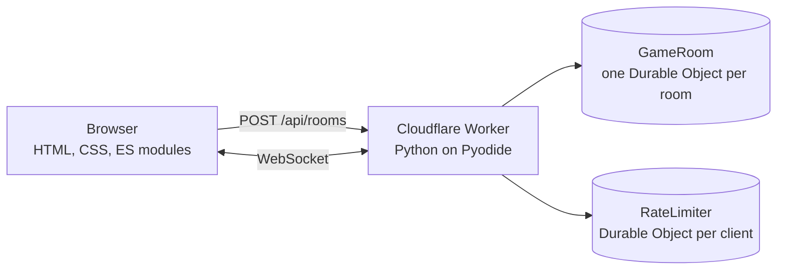

<p align="center">
  
</p>

<p align="center">
  <b>A two-player naval battle that runs in the browser.</b><br>
  Create a room, share its code, place five ships on a 10 × 10 grid and take turns
  firing until one fleet is sunk. No account and nothing to install.
</p>

<p align="center">
  <a href="https://naval.cloudils.com">Play it</a> ·
  <a href="https://github.com/Isma-L154/NavalGame/issues">Report a bug</a> ·
  <a href="#running-locally">Run it locally</a>
</p>

---

## What it does

- **Rooms for two.** A room has a six-character code and an invite link. Pick a nickname, send either to a friend, and play. A third visitor is turned away.
- **Play vs CPU.** No friend around? The server plays the other seat: it places its own fleet and fires back the way a person would, hunting at random until it hits and then finishing that ship.
- **Fleets placed by hand.** Drag ships onto the grid or select and click. A placed ship turns about the cell you touch and slides to the nearest free spot when it does not fit. Random does it for you.
- **Boards as game tables.** Each board is a table seen in perspective, with low-poly ships standing on it, a red peg on every hit and ships that go down when sunk. Drag a table with the mouse to turn it.
- **Your seat is kept.** Reload the page or lose the connection and you get your seat back within two minutes. When the game ends, either player can ask for a rematch.
- **Signal flags.** Each player flies a maritime signal flag, picked at home or taken from the nickname's first letter.
- **Sound, light and dark.** Six short cues synthesised in the browser, with a toggle that is remembered, and a dark theme that follows the system until you choose.
- **Playable with the keyboard.** Every action has a keyboard path, and hit, miss and sunk are told apart by shape, never by colour alone.

## How it works



The server is the only authority. Each room is a Durable Object that owns the game state, enforces every rule and keeps exactly two seats; players talk to it over hibernatable WebSockets. The browser is a view: it never learns where the enemy ships are until the game ends.

The code is layered so that the rules run on plain CPython, without Cloudflare:

| Layer | What lives there |
|---|---|
| `src/naval/domain` | Pure game rules: coordinates, fleet, board, the game state machine, the CPU's strategy. |
| `src/naval/protocol` | Message schemas and the per-player view of a game. |
| `src/naval/rooms` | Room lifecycle: seats, reconnection tokens, timeouts, the room service. |
| `src/naval/limits` | Per-client rate-limit windows. |
| `src/naval/worker` | Thin Cloudflare adapters: the Worker entry point and the Durable Objects. |
| `public/` | The frontend, served as static assets with no build step. |

Dependencies point inward (`worker → rooms → protocol → domain`), and only `worker` imports anything from Cloudflare.

**Stack:** Python 3.14 on Cloudflare Workers (Pyodide) · Durable Objects · Pydantic · plain HTML, CSS and ES modules · pytest, Hypothesis and Playwright

Design and decisions: [`docs/superpowers/specs/`](docs/superpowers/specs/), starting with [the game's design](docs/superpowers/specs/2026-09-27-naval-game-design.md).

## Running locally

Needs [uv](https://docs.astral.sh/uv/) (the standalone binary) and Node.js 24.

```sh
uv sync
npm ci
cp .dev.vars.example .dev.vars
uv run pywrangler dev            # http://localhost:8787
```

On Windows, with the repository on a drive other than `C:`, see the note in [`CLAUDE.md`](CLAUDE.md#commands) about `UV_CACHE_DIR` and `UV_PYTHON_INSTALL_DIR`.

### Tests

| What | Command |
|---|---|
| Unit and property tests | `uv run pytest` |
| Frontend unit tests (pure modules) | `node --test "tests/frontend/*.test.mjs"` |
| HTTP and WebSocket, against the dev server | `NAVAL_BASE_URL=http://localhost:8787 uv run pytest -m integration` |
| Browser end-to-end: desktop, mobile and tablet | `npx playwright install chromium` once, then `npx playwright test` |
| Lint, format and types | `uv run ruff check . && uv run ruff format --check . && uv run mypy src tests` |

### Images

The banner above (`docs/brand/readme-banner.png`), the share card (`public/og-image.png`) and the home-screen icon (`public/apple-touch-icon.png`) are rendered from the sources in `design/` and committed. After changing a source, run `node scripts/render-og-image.mjs`.

The banner draws its table with the site's own stylesheet and board code, so it shows the game as it is; re-render it when the board changes.

## Deployment

Every merge to `main` runs CI again, deploys to Cloudflare, waits until production serves the new version and then plays a real game against it as a smoke test.

It needs the `CLOUDFLARE_API_TOKEN` secret and the `CLOUDFLARE_ACCOUNT_ID` variable in the repository's `production` environment. To deploy by hand, only in an emergency: `uv run pywrangler deploy`.

## Contributing

`main` only changes through pull requests that reference an issue. CI (lint, types, unit, Semgrep, integration and end-to-end tests) must pass before a merge.

## Security

- Every rule is enforced on the server, and a player's view never contains the opponent's ships before the game is over.
- Every HTTP body and WebSocket message is parsed by a strict schema; anything else is rejected.
- Room creation and WebSocket upgrades check the `Origin` header and are rate-limited per client; each connection has a message budget.
- Seat tokens are random, and the server stores only their SHA-256 hashes.
- The site ships a strict Content Security Policy, with no inline scripts or styles.

Report vulnerabilities privately: see [`SECURITY.md`](SECURITY.md). How the baseline controls apply is in [`CLAUDE.md`](CLAUDE.md#how-the-seven-controls-apply-to-navalgame), and audits and reviews are in [`docs/security/`](docs/security/).

## License

[MIT](LICENSE)
